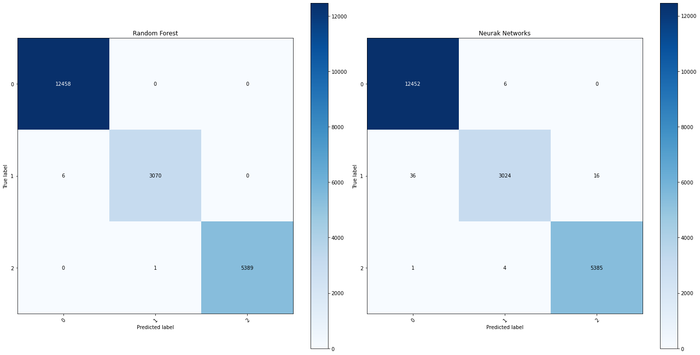

# Portfolio from Gonzalo Mazzini (s202683@student.dtu.dk)

## Machine Learning projects related to Wind Energy.
* SCADA data from Wind Turbine Generators (WTG).
* Data set from EDP.

### Classification: Random Forest and ANN models in order to predict the status of the WTG.
* inputs for the model: Wind Speed, Power, Generator RPM, Blade Pitch Angle
* Confusion matrix showing a high accurancy for both models.

### Clustering: Using the K-mean clustering algorithm and Gaussian Mixture (GM) model to classify the points in the Power Curve.
* Unsupervised learning problem 
* K-mean clustering exhibits a more reasonable clutering.

# [Regression - KNN regressor surrogate load model for Blade Flapwise Moment.](https://github.com/GonMazzini/Reliability-Analysis)
* KNN model with Cross-Validation (5 folds) in order to find the optimum value of K.
* With the model output, a Python implementation for First Order Reliability Method (FORM) and Monte Carlo as well.

